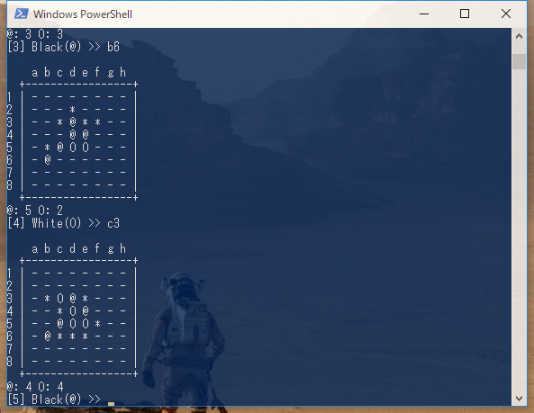

# Reversi

## Description

A reversi game for 2 players



- Disks are indicated by characters `@` (Black) and `O` (White)
- Coordinate: a row character (`a` to `h`) and a column number (`1` to `8`)
    - `a1` (upper left), `b2`, ..., `h8` (lower right)
- A player can put him disk in turn by input coordinate

## Testing Environment

- Windows10 64bit
- gcc version 6.3.0
- GNU Make 3.82.90
    - MinGW (Minimalist GNU for Windows)

## Build and Run

Windows
```
$ mingw32-make
$ ./reversi.exe
```

## License

[](http://www.wtfpl.net/)

## References (Japanese)

- [オセロ・リバーシプログラミング講座 ～勝ち方・考え方～](http://uguisu.skr.jp/othello/)
- [オセロプログラムの作り方](http://hp.vector.co.jp/authors/VA015468/platina/algo/)